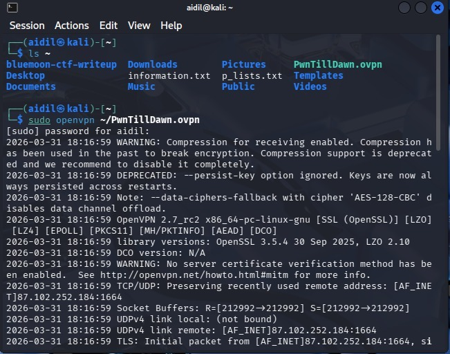
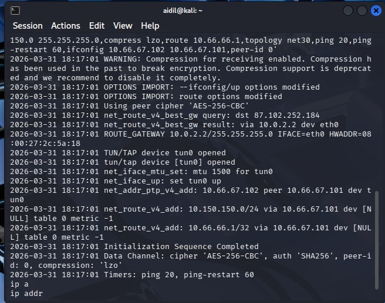
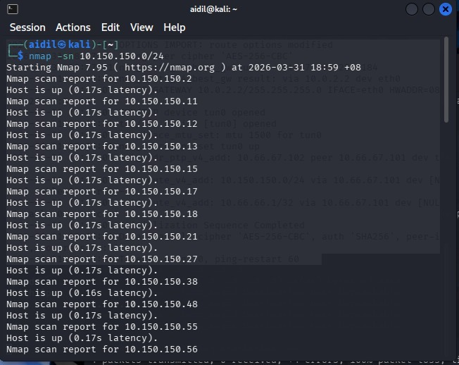

# PwnDrive - Full System Compromise Walkthrough

**Target:** 10.150.150.11  
**Environment:** Windows / Apache (XAMPP)  
**Objective:** Gain RCE, escalate to SYSTEM, and retrieve FLAG1.txt.

---

## 1. Phase 1: Reconnaissance & Network Mapping

The engagement began by establishing a connection to the lab network and identifying the target host.

* **VPN Initialization:** Connection established via OpenVPN.
    
    
* **Host Discovery:** Nmap scan confirmed the target at `10.150.150.11`.
    
* **Service Enumeration:** A full port scan identified HTTP (80) and HTTPS (443) services running on an Apache server.
    

---

## 2. Phase 2: Vulnerability Analysis

Upon visiting the web application, I identified a file upload portal named **PwnDrive**. 

* **Initial Access:** Navigated to the site to confirm it was live.
    
* **Authentication:** Located the administrative login page to reach the upload interface.
    
* **Exploit Research:** `searchsploit` was used to check for known vulnerabilities in the PwnDrive software; however, no public exploits were found.
    

---

## 3. Phase 3: Exploitation (File Upload Bypass)

The server employed a blacklist filter to prevent the upload of `.php` files. 

* **The Bypass:** Uploaded a web shell using a case-sensitivity bypass by changing the extension to `.PhP`.
    
* **Execution:** The server accepted the renamed file and processed it as executable code.
* **Access Verification:** Running the `whoami` command confirmed the shell was running as **`nt authority\system`**.
    

---

## 4. Phase 4: Post-Exploitation & Flag Retrieval

With SYSTEM privileges, I performed local enumeration to find the target data.

* **Directory Discovery:** Searched the Administrator's Desktop and found the flag file.
    
* **Flag Location:** Confirmed the file path and presence of `FLAG1.txt`.
    
* **Flag Capture:** Used the `type` command to extract the secret key.
    

**Flag:** `PwnTillDawnAcademyIsAwesome!!!`

---

## 5. Phase 5: Clearing Tracks

To conclude the engagement, the web shell was deleted from the server to minimize the forensic footprint. 

* **Cleanup Command:** `del C:\xampp\htdocs\upload\2\shell.PhP`
    
* **Verification:** A 403 Forbidden error confirmed the shell was successfully removed and the directory was secured.
    

---
*Developed for educational purposes in a controlled lab environment.*
